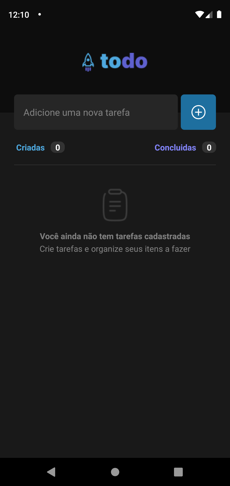
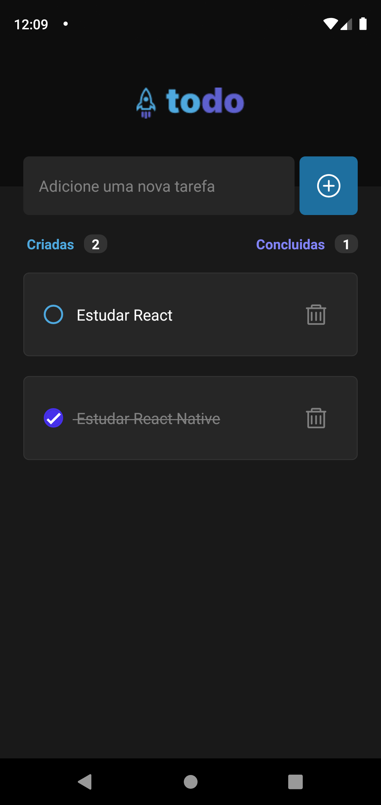
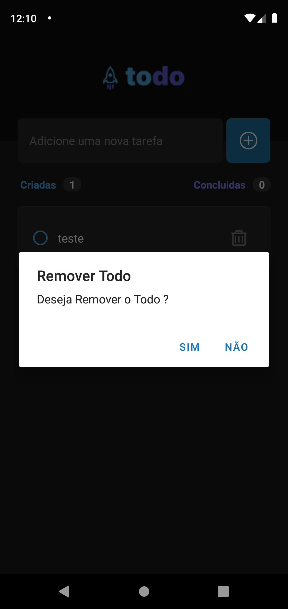

<h1>Portfolio desenvolvido com React Native</h1>
<h4>🚀 Projeto Todo List </h4>

<h2>🚧 Status do projeto</h2>

Finalizado

<h2>🖥️ Pré-requisitos e como rodar a aplicação/testes</h2>

Antes de começar, você vai precisar ter instalado em sua máquina as seguintes ferramentas:
[Git](https://git-scm.com) 

<h3>Rodando a Aplicação</h3>
<ul>
	<li>Clone esse repositório(git clone)</li>
 	<li>Instale as dependências(yarn)</li>
	<li>Execute a aplicação em modo de desenvolvimento(yarn start)</li>
  
</ul>

<h2>🤖 Tecnologias Utilizadas</h2>

  
 

<h2>🖼️ Demonstração da aplicação</h2>

<h2>🧑🏻‍ Autor</h2>

Feito por João paulo

